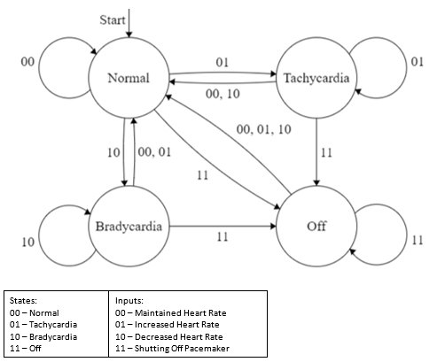
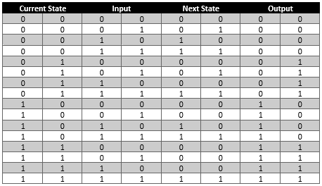
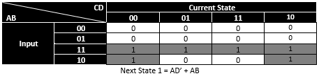
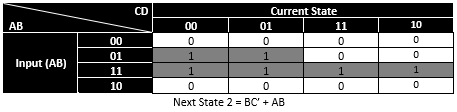
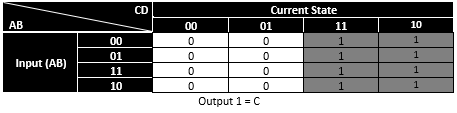
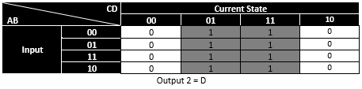

# Pacemaker FSM
This is a repository for simulating a simple pacemaker logic with 4 states and 4 different inputs along with a truth table, a Karnaugh map and a simulation of said FSM in C.

## FSM Diagram

In the diagram, the 4 states are Normal (00), Tachycardia (01), Bradycardia (10) and Off (00). These are very simplified conditions for a pacemaker as Tachycardia is a general term used for heart that beats more than 100 times a minute and Bradycardia is a general term used for heart that beats fewer than 60 times a minute. The pacemaker functions by monitoring the users heart rate by determining whether the user has a normal heart rate (00), an increased heart rate (01) and a decreased heart rate (10) which would be considered as passive inputs and a manual input in which the pacemaker would be turned off (11).

## Truth Table 

## Karnaugh Map
### Next State 1

### Next State 2

### Output 1

### Output 2

